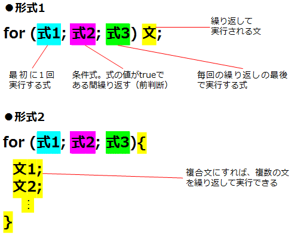

# 
## TypeScript とは
### 1. TypeScriptはJavaScriptのスーパーセットである
  
既存のJavaScriptプログラムは、全て有効なTypeScriptプログラムとなる
### 2. 静的型付けとクラスベースオブジェクト指向
### 3. TypeScriptは大規模なアプリケーションの開発のために設計されている
### 4. オープンソース
### 5. JavaScriptにコンパイルされる
### 6. TypeScriptでは変数の宣言時にデータ型を指定できる

## Hello World

簡単なHello Worldプログラムを作ってみよう

```TypeScript
const message: string = 'Hello World!'
console.log(message) //ブラウザでF12を押す、consoleで確認できる
alert(message) //alertが出る
```
[Playground](http://www.typescriptlang.org/play/#src=const%20message%3A%20string%20%3D%20'Hello%20World!'%3B%0D%0Aconsole.log(message)%3B%0D%0Aalert(message)%3B)でコンパイル

## 変数と宣言
```TypeScript
const message: string = 'This is a book'
----------------------------------------
const: 変数を宣言するためのキーワード
message: 変数名
string: データ型 
```
### Var

従来の JavaScript での変数宣言には var キーワードが使われてきました。

```TypeScript
var x = 0
```

## 基本の型
### 1. boolean

真偽値（trueまたはfalseのいずれかの値）

in TypeScript

``` TypeScript
const done: boolean = true
```
in JavaScript

```JavaScript
var done = false
```

### 2. number
数値はすべて浮動小数点として扱います。  
16 進数、10 進数に加えて、8 進数、2 進数もサポートしてます。

in TypeScript

``` TypeScript
const decimal: number = 6
const hex: number = 0x2537
const binary: number = 0b1010
const octal: number = 0o22467
```

in JavaScript

```JavaScript
var decimal = 6
var hex = 0x2537
var binary = 10
var octal = 0o22467
```
### 3. String
文字列はダブルクォート(")またはシングルクォート(')で囲みます。

in TypeScript

```TypeScript
const message: string
message = 'Happy BirthDay'
```

in JavaScript

```JavaScript
const message = 'Happy new year'
```

### 4. Array(配列)

in TypeScript

```TypeScript
let Array1: number[] = [1,2,3]
let Array2: Array<number> = [4,5,6]
```

in JavaScript
```JavaScript
var array =  [7,8,9]
```

### 5. Enum(列挙型)

#### Numeric enum

in TypeScript

```TypeScript
enum Color {
  red=1,
  green,
  blue} 
// red = 1 , green = 2 , blue = 3
const sky: Color = Color.blue 
// sky = 3
alert(sky)

```
[Playground](http://www.typescriptlang.org/play/#src=enum%20Color%20%7B%20red%20%3D%201%2C%20green%2C%20blue%20%7D%3Bconst%20sky%3A%20Color%20%3D%20Color.blue%3Balert(sky)%3B)でコンパイル

in JavaScript

```JavaScript
var Color;
(function (Color) {
    Color[Color["red"] = 1] = "red";
    Color[Color["green"] = 2] = "green";
    Color[Color["blue"] = 3] = "blue";
})(Color || (Color = {}));
// red = 1 , green = 2 , blue = 3
var sky = Color.blue;
// sky = 3
alert(sky);

```

上記の例は red が 1 として初期化されている数値 enum となります。  
他のメンバの値は自動的にインクリメントして定義されます。  
つまり、Color.red は 1、green は 2、blue は 3となります。  

#### String enums

```TypeScript
enum Direction {
    Up = 'UP',
    Down = 'DOWN',
    Left = 'LEFT',
    Right = 'RIGHT',
}

const key: Direction = Direction.Down
console.log(key) //'DOWN'
console.log(typeof key) //string

```
[Playground](http://www.typescriptlang.org/play/#src=enum%20Direction%20%7B%20Up%20%3D%20'UP'%2C%20Down%20%3D%20'DOWN'%2C%20Left%20%3D%20'LEFT'%2C%20Right%20%3D%20'RIGHT'%2C%20%7D%3B%20const%20key%3A%20Direction%20%3D%20Direction.Down%3B%20console.log(key)%3B%20console.log(typeof%20key)%3B)でコンパイル

### 6. Date
TypeScript で現在の日付時刻を格納する変数nowを得るには以下のように記述

```TypeScript
const now = new Date()
const hour = now.getHours()
console.log('今は' + hour + '時')
const minute = now.getMinutes()
console.log('今は' + minute + '分')
const second = now.getSeconds()
console.log('今は' + second + '秒')
const year = now.getFullYear()
console.log('今日は' + year + '年')
const month = now.getMonth() +1
// new Date の第 2 引数でも、Date.prototype.getMonth でも、月は 0-11で表すので、ここは+1。
console.log('今日は' + month + '月');
const date = now.getDate();
console.log('今日は' + date + '日');
const day = now.getDay();
console.log('今日は' + day + '曜日');
const today = now.toDateString();
console.log(today);
// 曜日 月 日 年 並び 例：Wed May 30 2018
const today2 = now.toJSON().slice(0, 10);
console.log(today2);
//yyyy-MM-dd 並び 例：2018-5-30

```
[Playground](http://www.typescriptlang.org/play/#src=const%20now%20%3D%20new%20Date()%3B%0D%0Aconst%20hour%20%3D%20now.getHours()%3B%0D%0Aconsole.log('%E4%BB%8A%E3%81%AF'%20%2B%20hour%20%2B%20'%E6%99%82')%3B%0D%0Aconst%20minute%20%3D%20now.getMinutes()%3B%0D%0Aconsole.log('%E4%BB%8A%E3%81%AF'%20%2B%20minute%20%2B%20'%E5%88%86')%3B%0D%0Aconst%20second%20%3D%20now.getSeconds()%3B%0D%0Aconsole.log('%E4%BB%8A%E3%81%AF'%20%2B%20second%20%2B%20'%E7%A7%92')%3B%0D%0Aconst%20year%20%3D%20now.getFullYear()%3B%0D%0Aconsole.log('%E4%BB%8A%E6%97%A5%E3%81%AF'%20%2B%20year%20%2B%20'%E5%B9%B4')%3B%0D%0Aconst%20month%20%3D%20now.getMonth()%20%2B1%20%3B%0D%0Aconsole.log('%E4%BB%8A%E6%97%A5%E3%81%AF'%20%2B%20month%20%2B%20'%E6%9C%88')%3B%0D%0Aconst%20date%20%3D%20now.getDate()%3B%0D%0Aconsole.log('%E4%BB%8A%E6%97%A5%E3%81%AF'%20%2B%20date%20%2B%20'%E6%97%A5')%3B%0D%0Aconst%20day%20%3D%20now.getDay()%3B%0D%0Aconsole.log('%E4%BB%8A%E6%97%A5%E3%81%AF'%20%2B%20day%20%2B%20'%E6%9B%9C%E6%97%A5')%3B%0D%0Aconst%20today%20%3D%20now.toDateString()%3B%0D%0Aconsole.log(today)%3B%0D%0Aconst%20today2%20%3D%20now.toJSON().slice(0%2C%2010)%3B%0D%0Aconsole.log(today2)%3B%0D%0A) でコンパイル

### 7. Any

Any 型を使えば型チェックをバイパスすることができます。

**変数のデータ型を指定しない場合は「any」が指定されたものと見なされる。**

```TypeScript
let notSure: any = 4
console.log(typeof notSure) //number
notSure = 'maybe a string instead'
console.log(typeof notSure) //string
notSure = false
console.log(typeof notSure) //boolean

//typeof 変数名は変数の型をチェックすることができる

```
[Playground](http://www.typescriptlang.org/play/#src=let%20notSure%3A%20any%20%3D%204%3B%20console.log(typeof%20notSure)%3BnotSure%20%3D%20'maybe%20a%20string%20instead'%3Bconsole.log(typeof%20notSure)%3BnotSure%20%3D%20false%3Bconsole.log(typeof%20notSure)%3B)でコンパイル

Any 型は他の型の一部としても使えます。

```TypeScript
let list: any[] = [1, true, "free"] 
// 任意の型を含められる
```

TypeScriptでは宣言時に変数の値を代入（初期化）しておくと、変数のデータ型が自動的に推測されて決められる

```TypeScript
let price // any型
price = 1000 
console.log(typeof price) // number
price = '無料' // 文字列も代入できる

let value = 5000 // number型と推測される
value = '高い' // 文字列を代入しようとするとエラーになる
```
[Playground](http://www.typescriptlang.org/play/#src=let%20price%3Bprice%20%3D%201000%3Bconsole.log(typeof%20price)%3Bprice%20%3D%20'%E7%84%A1%E6%96%99'%3Blet%20value%20%3D%205000%3Bvalue%20%3D%20'%E9%AB%98%E3%81%84'%3B)でコンパイル

### 8. Void

Void は型がないことを表すもので、値を返さない関数の戻り値でよく使います。

```TypeScript
function warnUser(): void {
    alert("This is my warning message")
}
```

Void 型には undefined か null しか代入できません。

```TypeScript
const unusable: void = undefined
```

### 9. Null と Undefined

Null 型と Undefined 型にはそれぞれの値しか代入できません。

```TypeScript
const u: undefined = undefined;
const n: null = null;
```

## 式と演算

### 1. 簡単な演算

以下のコードで割引後の金額が計算できる

```TypeScript
let price,discount,total:number
price = 1000
discount = 0.75
total = price*discount
alert(total)
```
[Playground](http://www.typescriptlang.org/play/#src=let%20price%2C%20discount%2C%20total%3A%20number%3B%0Aprice%20%3D%201000%3B%0Adiscount%20%3D%200.75%3B%0Atotal%20%3D%20price%20*%20discount%3B%0Aalert(total)%3B) でコンパイル

演算とは、広い意味で「計算すること」と考えていいが、変数に値を入れる代入も演算であることに注意しよう。  
また、演算に使う記号のことを「演算子」と呼ぶ。ここでは、「=」や「*」「+」が演算子だ。

### 2. 論理演算子
#### ①論理演算子 !
英語notの意味。

```TypeScript
const a = !0
alert(a) // true
const b = !!0
alert(b) //false

```

#### ②理論演算子 &&

英語andの意味

```TypeScript
const a = true && true
alert(a) // true
const b = true && false
alert(b) // false
const c = true && (4 > 3)
alert(c) // true
```

#### ③理論演算子 ||
英語orの意味

```TypeScript
const a = true || true
alert(a) //true
const b = true || false
alert(b) //true
const c = false || false
alert(c) //false
const d = (4<3)|| 'cat'
alert(d) //cat
```


### 3. インスタンス作成

```TypeScript
class SmartPhone{
  brand: string
  model: string
  generation: number
}

const i8 = new SmartPhone()
i8.brand = 'apple '
i8.model = 'iPhone '
i8.generation = 8

alert('I have the new' + ' ' + i8.brand + i8.model + i8.generation)
```
[Playground](http://www.typescriptlang.org/play/#src=class%20SmartPhone%7B%0D%0A%20%20%20%20brand%3A%20string%3B%0D%0A%20%20%20%20model%3A%20string%3B%0D%0A%20%20%20%20generation%3A%20number%3B%0D%0A%7D%0D%0A%0D%0Aconst%20i8%20%3D%20new%20SmartPhone()%3B%0D%0Ai8.brand%20%3D%20'apple%20'%3B%0D%0Ai8.model%20%3D%20'iPhone%20'%3B%0D%0Ai8.generation%20%3D%208%3B%0D%0A%0D%0Aalert('I%20have%20the%20new'%20%2B%20'%20'%20%2B%20i8.brand%20%2B%20i8.model%20%2B%20i8.generation)%3B) でコンパイル

i8とbrandを区切る「.」に注目してほしい。「.」はクラスのメンバーを参照するための演算子である。  
「new」も演算子の1つであり、クラスのインスタンスを作成し、その参照を返す働きを持っている。  
「+」という演算子が使われているが、これは最初に見たような数値の加算ではなく、文字列を連結するという働きを持つ。

### 4. 演算子の結合方向

例えば、代入演算子の「=」や「+=」は「←（右から左）」となっているので、右から左に向かって演算が実行される。

```TypeScript
let a , b :number
b = 7
a = b+=2 // 「b += 2」が実行された後、「a = b」が実行される
alert ('a='+ a + 'b=' + b)
```
[Playground](http://www.typescriptlang.org/play/#src=let%20a%2C%20b%3A%20number%3B%0D%0Ab%20%3D%207%3B%0D%0Aa%20%3D%20b%20%2B%3D%202%3B%0D%0Aalert('a%3D'%20%2B%20a%20%2B%20'b%3D'%20%2B%20b)%3B) でコンパイル

「+=」は、変数の値に右辺の値を加算した値を変数に代入するための演算子である
```TypeScript
// 以下の2つは同じ意味
b = b + 2
b += 2
```

### 5. インクリメントとデクリメント

#### ①前置型インクリメント演算子

```TypeScript
let a : number = 99
alert(++a) //100
```
[Playground](http://www.typescriptlang.org/play/#src=let%20a%3A%20number%20%3D%2099%3B%0D%0Aalert(%2B%2Ba)%3B) でコンパイル

#### ②後置型デクリメント演算子

```TypeScript
const b : number = 17
alert(b--) //17
alert(b) //16 
```
[Playground](hhttp://www.typescriptlang.org/play/#src=let%20b%3A%20number%20%3D%2017%3B%0D%0Aalert(b--)%3B%0D%0Aalert(b)%3B) でコンパイル

**前置型**ー変数の値が増やされたあと、変数の値が返される

**後置型**ー変数の値は増やされるが、返される値は元の値

### 6. 比較演算子

```TypeScript
18 <= x < 25 //誤った例
18 <= x && x < 25 //正しい書き方
```

複数の条件を調べたいときには、論理積を求める「&&」演算子や論理和を求める「||」演算子を使う。

### 7. 特殊演算子

#### ①typeof
変数の型がチェックできる

```TypeScript
const a = 'Hello'
const b: typeof a = a
alert(b) // Hello
```
[Playground](http://www.typescriptlang.org/play/#src=const%20a%20%3D%20'Hello'%3B%0D%0Aconst%20b%3A%20typeof%20a%20%3D%20a%3B%0D%0Aalert(b)%3B) でコンパイル

#### ②instanceof
インスタンスの関係かどうかチェックできる

```TypeScript
function a() {
    console.log('Hello world')
}
const b = new a()
const c = b instanceof a
alert(c) // true
```
[Playground](http://www.typescriptlang.org/play/#src=function%20a()%20%7B%0D%0A%20%20%20%20console.log('Hello%20world')%3B%0D%0A%7D%0D%0Aconst%20b%20%3D%20new%20a()%3B%0D%0Aconst%20c%20%3D%20b%20instanceof%20a%3B%0D%0Aalert(c)%3B) でコンパイル

## 条件分岐

### 1. if ... else文を使った例
式の値によって異なる文を実行する。if文を組み合わせ、異なる変数の値を調べて多分岐させることもできる

```TypeScript
let a: number
function dize() {
 a =Math.floor(Math.random() * 6) + 1 // a = random number from 1-6
}
dize()
if (a>3) {
  alert( a + ' is big')
}
else {
  alert( a + ' is small')
}
```

[Playground](http://www.typescriptlang.org/play/#src=let%20a%3A%20number%3B%0Afunction%20dize()%20%7B%0A%09a%20%3D%20Math.floor(Math.random()%20*%206)%20%2B%201%3B%0A%7D%0Adize()%3B%0Aif%20(a%3E3)%20%7B%0A%09alert(a%20%2B%20'%20is%20big')%3B%0A%7D%0Aelse%20%7B%0A%09alert(a%20%2B%20'%20is%20small')%3B%0A%7D) でコンパイル

### 2. switch文を使った例

変数の値によって異なる文を実行する。1つの変数の値を調べて多分岐させるときに便利

```TypeScript
var fortune: string
var n: number
n = Math.floor(Math.random() * 7)
switch (n) {
  case 0:
  case 1:
    fortune = '大吉'
    break
  case 2:
    fortune = '中吉'
    break
  case 3:
  case 4:
    fortune = '小吉'
    break
  case 5:
    fortune = '凶'
    break
  default:
    fortune = '大凶'
}
alert(n + ":" + fortune);
```
[Playground](http://www.typescriptlang.org/play/#src=let%20fortune%3A%20string%3B%0Alet%20n%3A%20number%3B%0An%20%3D%20Math.floor(Math.random()%20*%207)%3B%20%0Aswitch%20(n)%20%7B%0A%09case%200%3A%0A%09case%201%3A%0A%09%09fortune%20%3D%20'%E5%A4%A7%E5%90%89'%3B%0A%09%09break%3B%0A%09case%202%3A%0A%09%09fortune%20%3D%20'%E4%B8%AD%E5%90%89'%3B%0A%09%09break%3B%0A%09case%203%3A%0A%09case%204%3A%0A%09%09fortune%20%3D%20'%E5%B0%8F%E5%90%89'%3B%0A%09%09break%3B%0A%09case%205%3A%0A%09%09fortune%20%3D%20'%E5%87%B6'%3B%0A%09%09break%3B%0A%09default%3A%0A%09%09fortune%20%3D%20'%E5%A4%A7%E5%87%B6'%3B%0A%7D%0Aalert(n%20%2B%20'%3A'%2B%20fortune)%3B) でコンパイル

#### switch文の構造


1. switchの後の()の中の変数や式の値によって実行する文が変えられる
2. ()の中の変数や式の値がcaseの後に指定した値に一致すれば、それ以降の文が全て実行される
3. 1つのcaseの中には複数の文を書いてもよい
4. ただし、break文があると、そこでswitch文を抜けて、次の文に進む
5. defaultは他のcaseで指定していない全ての値に一致する（通常は「上記以外の場合」を表すために、最後に書かれる）

### 3. ?演算子
「条件式？式１：式２」という形、条件を満たしたら式１になる、満たさないければ式２になる。

```TypeScript
const score = 59
const pass: string = (score >= 60 ? "合格" : "不合格")
alert(pass) // 不合格
```
[Playground](http://www.typescriptlang.org/play/#src=const%20score%20%3D%2059%3B%0D%0Aconst%20pass%3A%20string%20%3D%20(score%20%3E%3D%2060%20%3F%20%22%E5%90%88%E6%A0%BC%22%20%3A%20%22%E4%B8%8D%E5%90%88%E6%A0%BC%22)%3B%0D%0Aalert(pass)%3B) でコンパイル

## 繰り返し処理
条件を満たしている間、同じ文を繰り返して実行したり、一定の回数だけ文を繰り返し実行したりする

### 1. while 文
式の値がtrueである間、文を繰り返し実行する。式の値を毎回の繰り返しの前に判定する（前判断型while）。  
以下のプログラムはサイコロを振ったときに、6が出るまでに何回かかったかを表示する。つまり、6以外の目が出ている間、サイコロを振り続ける（処理を繰り返す）というわけだ．

```TypeScript
let count: number = 1
let dice: number = Math.floor(Math.random() * 6) + 1
const list = new Array()
while (dice != 6) {
	count++
	list.push(dice)
	dice = Math.floor(Math.random() * 6) + 1
}
alert('[' + list + ']' + ' 6が出るまで' + count + '回')
window.close()
```
[Playground](http://www.typescriptlang.org/play/#src=let%20count%3A%20number%20%3D%201%3B%0Alet%20dice%3A%20number%3B%0Adice%20%3D%20Math.floor(Math.random()%20*%206)%20%2B%201%3B%0Aconst%20list%20%3D%20new%20Array()%3B%0Awhile%20(dice%20!%3D%206)%20%7B%0A%09count%2B%2B%3B%0A%09list.push(dice)%3B%0A%09dice%20%3D%20Math.floor(Math.random()%20*%206)%20%2B%201%3B%0A%7D%0Aalert('%5B'%20%2B%20list%20%2B%20'%5D'%20%2B%20'%206%E3%81%8C%E5%87%BA%E3%82%8B%E3%81%BE%E3%81%A7'%20%2B%20count%20%2B%20'%E5%9B%9E')%3B%0Awindow.close()%3B) でコンパイル

#### while文の構造


#### while文の流れ


### 2. do...while文
式の値がtrueである間、文を繰り返し実行する。  
式の値を毎回の繰り返しの後に判定する（後判断型while）  
同じサイコロの例です。

```TypeScript
let count: number = 0
let dice: number
const list = new Array()
do {
	dice = Math.floor(Math.random() * 6) + 1
  	list.push(dice)
  	count++
} while (dice != 6)
alert('[' + list + ']' + ' 6が出るまで' + count + '回')
window.close()
```
[Playground](http://www.typescriptlang.org/play/#src=let%20count%3A%20number%20%3D%200%3B%0Alet%20dice%3A%20number%3B%0Aconst%20list%20%3D%20new%20Array()%3B%0Ado%20%7B%0A%09dice%20%3D%20Math.floor(Math.random()%20*%206)%20%2B%201%3B%0A%20%20%09list.push(dice)%3B%0A%20%20%09count%2B%2B%3B%0A%7D%20while%20(dice%20!%3D%206)%3B%0Aalert('%5B'%20%2B%20list%20%2B%20'%5D'%20%2B%20'%206%E3%81%8C%E5%87%BA%E3%82%8B%E3%81%BE%E3%81%A7'%20%2B%20count%20%2B%20'%E5%9B%9E')%3B%0Awindow.close()%3B) でコンパイル

#### do...while文の構造


#### do...while文の流れ


### 3. for文
初期設定、繰り返しの条件、毎回の繰り返しの後に実行する処理をまとめて書ける文。  
一定回数の繰り返し処理によく使われる。

```TypeScript
let a = 0
for (let i = 1; i < 10; i++){
	a += i
}
alert(a) // 45
```
#### for文の構造


#### for文の流れ


### 4. for...in文
オブジェクトの全てのプロパティの値に対して繰り返し処理を行う

```TypeScript
class Smartphone {
	name:string
	camera:string
	screenSize:string
}
var i:Smartphone = new Smartphone();
i.name = 'iPhone8'
i.camera = '1200Mpx'
i.screenSize = '4.7"'
document.body.innerHTML = 'スマホ仕様<br/>'
for (var x in i) {
    document.body.innerHTML += x + ':' + i[x] + '<br/>'
}
```
#### for...in文の構造


## 配列
配列を宣言するには、全ての要素を代表するような変数名を一つ付けておけばよい。  
配列の個々の要素はインデックスと呼ばれる番号で区別する。

### 基本配列と出力
```TypeScript
let carBrandList: string[] = new Array(4) // 4つ入りの配列を宣言し、中身は文字列
carBrandList = ['Audi', 'Benz', 'BMW', 'Lexus']

console.log(carBrandList) // 0:'Audi', 1:'Benz', 2:'BMW', 3;'Lexus' Length=4
// 配列を出力

for (let brand of carBrandList) {
	console.log(brand) // Audi Benz BMW Lexus
} // 配列の内容を一つずつ出力

console.log(carBrandList[2]) // BMW
// 指定した配列の中身の順番を出力
```

[Playground](http://www.typescriptlang.org/play/#src=let%20carBrandList%3A%20string%5B%5D%20%3D%20new%20Array(4)%3B%0D%0AcarBrandList%20%3D%20%5B'Audi'%2C%20'Benz'%2C%20'BMW'%2C%20'Lexus'%5D%3B%0D%0A%0D%0Aconsole.log(carBrandList)%3B%0D%0A%0D%0Afor%20(let%20brand%20of%20carBrandList)%20%7B%0D%0A%09console.log(brand)%3B%0D%0A%7D%0D%0A%0D%0Aconsole.log(carBrandList%5B2%5D)%3B) でコンパイル

### 配列内容の追加と削除


